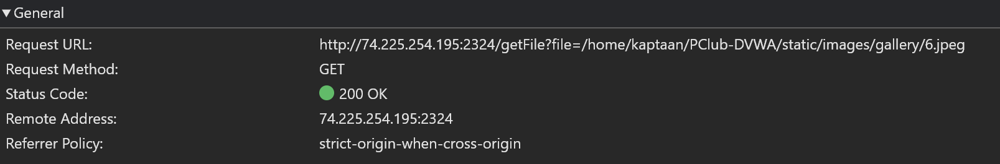
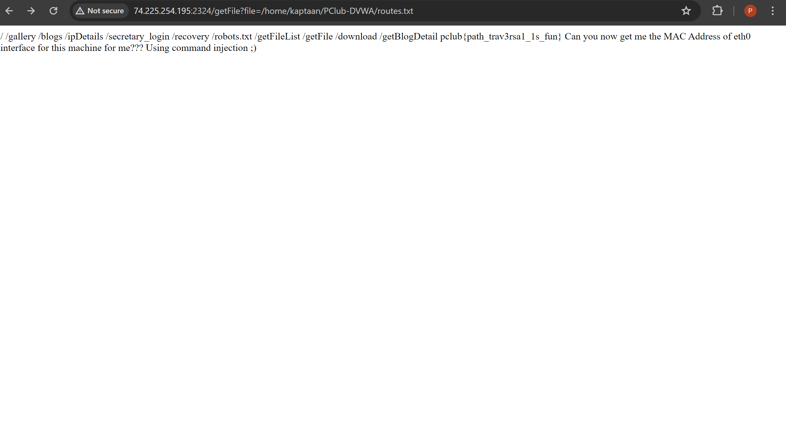
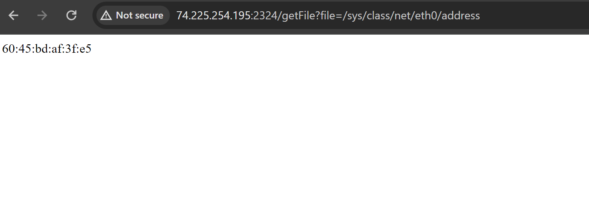
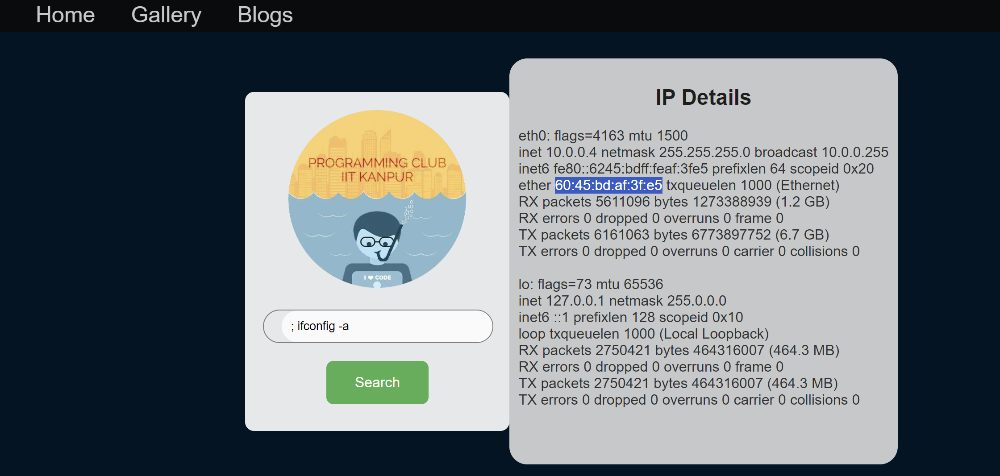
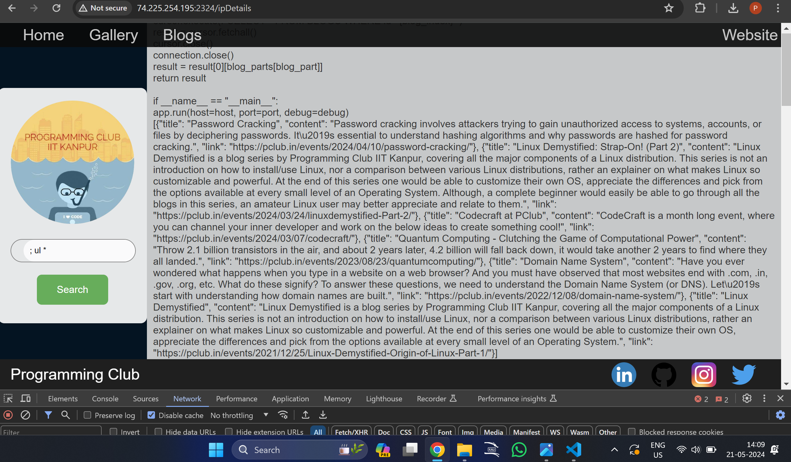
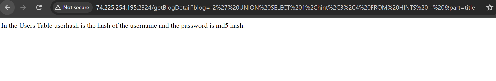
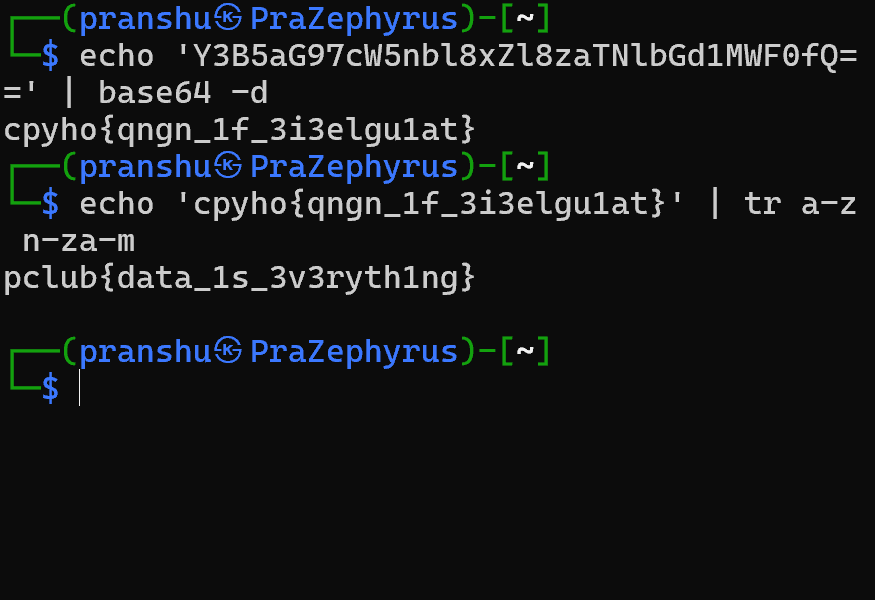

# PClub-DVWA CTF Writeup

## Description
A PClub Legend while trying to revamp the PClub Website introduced some vulnerabilities because of his lack of knowledge of InfoSec. After getting to know about the security holes, he tried to save his reputation by saying that He was making a Project for PClub namely PClub DVWA (Damn Vulnerable Web Application) to spread awareness about Cyber Security. But he failed to save his reputation, because the website was already deployed and before it could be replaced by the old and secure Website, Sameer exploited one such Vulnerability and got to know that in the Directory of the website, there was a file routes.txt that stored a list of all routes that would lead anyone to further penetrate into the website and exploit more vulnerabilities. But fortunately, before he could try anything else, the website was taken down. Today the Website is again Hosted ONLY to spread awareness about Cyber Security. 

Goal: Find all the flags that could be obtained by exploiting the vulnerabilities present.  There are a total of 5 flags (4 Web Exploitation and 1 Cryptopwn ) . 

Website Link : 
http://74.225.254.195:2324/

## SOLUTION
Going to the website link provided in the challenge, we see it has links to the home page, a gallery page, a blog page and the official pclub website.

### 1. PATH TRAVERSAL EXPLOIT :
After looking around for a bit, we find that the gallery page uses the following request to get images:

We see that the path specified is 
`/home/kaptaan/PClub-DVWA/static/images/gallery/6.jpeg `
From the description, it seems that the
` /home/kaptaan/PClub-DVWA `
directory should have a file `routes.txt`. Changing the file parameter to 
` /home/kaptaan/PClub-DVWA/routes.txt ` ,
There it is!

We see that the file contains more routes for the website.
It gives us our first flag:
**pclub{path_trav3rsa1_1s_fun}**
It also tells us how to find the next one. Although it specifies us to use command injection, we can also get the eth0 mac address via this path traversal vulnerability, by specifying path as
`/sys/class/net/eth0/address`.
We get:

So the 2nd flag would be 
**pclub{60:45:bd:af:3f:e5}**

### 2. COMMAND INJECTION EXPLOIT :
Checking the different routes, I first checked for vulnerabilities in the
`/secretary_login` page, but I couldn't seem to find any. Next, I went to `/ipDetails` and found that commands could be injected by beginning with a semicolon to end the previous command. First, to get the eth0 mac address, I used `; ifconfig -a`, which resulted in:

Then I decided to experiment with what other commands could be injected. Checking `pwd ` it worked, revealing that we are in ` /home/kaptaan/PClub-DVWA ` but on more experimenting, I found that many commands such as `ls`, `cat`, `echo`, etc. were not allowed and gave no output. This encouraged me to lookup alternative commands such as `ul` instead of `cat` and `printf '%s\n' *` instead of `ls` . Even though certain file extensions were filtered out, I found that I  could use `; ul *` to read all the files in a directory.

 At this point, the challenge was entirely broken as I was able to obtain the complete source code for the application. I have attached some of it in the repo.
Although this was later patched by filtering `ul` and `print`, I was able to get another workaround by using quotes. I found that commands like `l's'` and `e'c'ho` worked.
I also checked the directories to find that ` /home/kaptaan/PClub-DVWA/static/files ` had only 3 users whose files were present, namely `amansg22/ariitk.jpeg`, `ritvikg22/pwn_chall_link.txt` and `kaptaan/flag.txt`.
The third flag was:

**pclub{01d_1s_g01d_sql1}**

Now armed with the source, there were many varying methods I used to obtain these files. I used command injection as explained above, the path traversal method, using the usernames and passwords found in `users.json` in the `/secretary_login` page as well as using the intended SQL injection exploit.

### 3. SQLi EXPLOIT :
I did not need to use this, but just to demonstrate, I did. Having looked at the source, I already knew that the getBlogDetails request was vulnerable to injection and I was able to craft queries to get information from the tables in the database.
Since only one result was being displayed, I made the blog index parameter negative to prevent it from being shown.
I used:

`-2' UNION SELECT 1,hint,3,4 FROM HINTS --`
`-2' UNION SELECT 1,password,3,4 FROM USERS WHERE user='amansg22' --`
and so on.

I got the hints that the passwords were md5 hashed and could be broken with a rock, referring to using rockyou.txt wordlist to  bruteforce the passwords.
Proceeding to use hashcat on the obtained hashes, they are easily broken with rockyou.txt .
In this way, I got the usernames and passwords for `/secretary_login` page (though I already had them :)
From here I got the third flag, as well as the files for the other 2 flags.

### 4. STEGANOGRAPHY :
Getting the `ariitk.jpeg` file, I used basic tools such as exiftool, binwalk on the file. It revealed nothing. I then opened it with hexedit to see if something was hidden there, but I found nothing. I used other standard tools such as stegsolve, and steghide.
On extracting with steghide, I got the `qr_code.png` file.

Scanning this gives
`Y3B5aG97cW5nbl8xZl8zaTNlbGd1MWF0fQ==`
which appears to be base64 encoded. Decoding this gives:
`cpyho{qngn_1f_3i3elgu1at}`
It looks like a Caesar cipher; checking ROT13 gives us the 4th flag :
**pclub{data_1s_3v3ryth1ng}**

### 5. CRYPTOPWN
The file has the following link:
https://pastebin.com/Jd17mvk5
Which gives us the file:
[whencryptomeetspwn.txt](whencryptomeetspwn.txt)
It has the link to the challenge file named [whathash](whathash)
and a random looking youtube video.